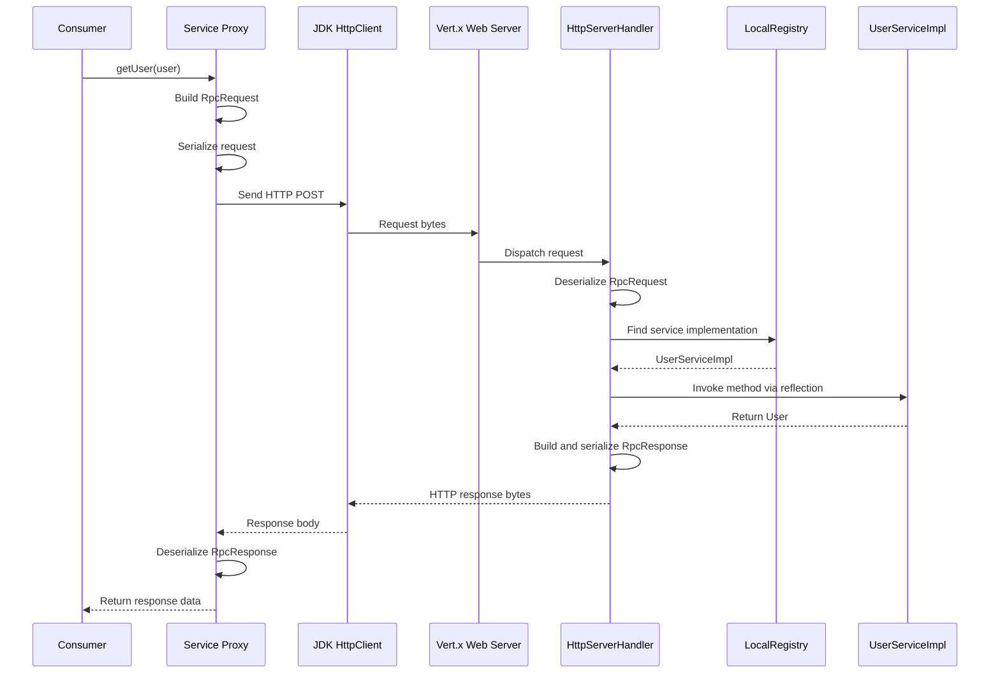
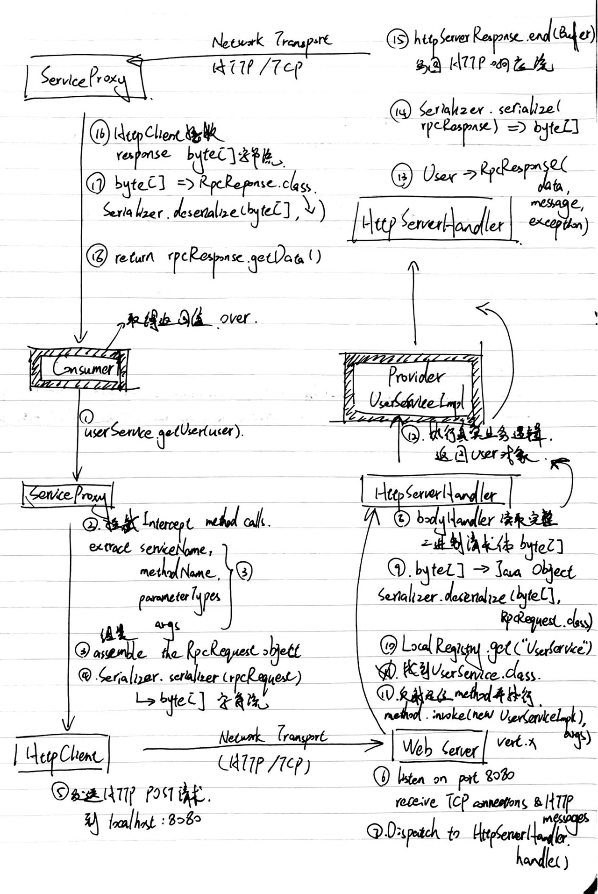

# RelayRPC

RelayRPC is a lightweight Java RPC framework built to understand how a remote method call works beneath higher-level frameworks. It currently provides a working consumer-to-provider call path with JDK dynamic proxies, HTTP transport, reflection-based dispatch, configurable serialization, and a custom SPI extension mechanism.

The project began as a guided RPC exercise and is being independently refactored around Java 21, standard JDK APIs, Jackson, Vert.x, and testable framework components.

> **Project status:** active learning project. The current version is a functional single-provider RPC prototype, not a production-ready framework.

## What it does

A consumer calls a normal Java service interface. RelayRPC turns that call into an `RpcRequest`, serializes it, sends it to the provider over HTTP, invokes the target method, and converts the returned bytes back into the declared Java type.


<details>
<summary>Original handwritten request lifecycle notes</summary>

These notes were created while tracing the request and response flow through
the first working version of RelayRPC.



</details>
## Current features

- Generic client stubs created with JDK dynamic proxies.
- HTTP request transport using the JDK `HttpClient`.
- Asynchronous provider server built with Vert.x.
- Thread-safe in-memory service registration through `LocalRegistry`.
- Reflection-based service lookup and method invocation.
- Immutable framework configuration loaded from `application.properties`.
- Validated defaults for the provider host, port, framework metadata, and serializer selection.
- JDK binary and Jackson JSON serializers behind a shared `Serializer` interface.
- Request-argument and response-payload type restoration after JSON deserialization.
- Custom SPI discovery from `META-INF` resources, including implementation validation and reusable instance caching.
- System and custom SPI locations, with custom registrations able to override built-in keys.
- 35 JUnit 5 test methods covering configuration, registries, serialization, SPI loading, and instance resolution.

## Technology

- Java 21
- Eclipse Vert.x 5
- Jackson 3
- Maven
- SLF4J and Logback
- JUnit 5

## Project structure

| Module | Responsibility |
| --- | --- |
| `relay-rpc-core` | RPC models, configuration, proxies, server, registry, serializers, and SPI loading |
| `relay-example-common` | Shared `User` model and `UserService` interface |
| `relay-example-provider` | Example service implementation and provider bootstrap |
| `relay-example-consumer` | Example consumer using a generated `UserService` proxy |

## Getting started

### Prerequisites

- JDK 21
- Maven 3.9 or later

### Build and test

```bash
git clone https://github.com/J-YuhanWang/relay-rpc.git
cd relay-rpc
mvn clean test
```

### Configure the examples

Both example applications read `application.properties` from their own runtime classpath:

```properties
relay.rpc.name=relay-rpc
relay.rpc.version=1.0
relay.rpc.server.host=localhost
relay.rpc.server.port=9090
relay.rpc.serializer=jdk
```

Supported serializer keys are currently:

| Key | Implementation |
| --- | --- |
| `jdk` | `JdkSerializer` |
| `json` | `JsonSerializer` |

The consumer and provider must use the same serializer. To try JSON, set the following property in both example modules:

```properties
relay.rpc.serializer=json
```

If `relay.rpc.serializer` is omitted, RelayRPC uses `jdk`.

### Run the example

After importing the root Maven project into your IDE:

1. Run `ProviderExample` from `relay-example-provider`.
2. Wait until the provider reports that it is listening on port `9090`.
3. Run `ConsumerExample` from `relay-example-consumer`.

The consumer creates a user remotely and then retrieves it through the generated `UserService` proxy.

Example output:

```text
RPC 1: created user with ID 1
RPC 2: queried user from server: Blair (ID: 1)
```

## Configuration flow

`RpcConfigLoader` reads the classpath configuration and applies user values over `RpcConfig.defaults()`. `RpcApplication` publishes the resulting immutable `RpcConfig` and initializes it lazily when necessary.

```text
application.properties
        -> RpcConfigLoader
        -> RpcConfig
        -> RpcApplication
        -> consumer, provider and serializer factory
```

Available properties:

| Property | Default | Purpose |
| --- | --- | --- |
| `relay.rpc.name` | `relay-rpc` | Framework/application name |
| `relay.rpc.version` | `1.0` | Framework/application version |
| `relay.rpc.server.host` | `localhost` | Provider host used by the consumer |
| `relay.rpc.server.port` | `8080` | Provider port |
| `relay.rpc.serializer` | `jdk` | Serializer implementation key |

The port must be an integer between `1` and `65535`. Invalid values fail during configuration loading with a descriptive exception.

## Serialization and SPI extension

`SerializerFactory` is the entry point used by both the client proxy and server handler. When the factory is initialized, `SpiLoader` discovers implementations registered for the `Serializer` interface.

Built-in registrations are stored at:

```text
META-INF/relayrpc/system/dev.yuhanwang.relayrpc.serializer.Serializer
```

with entries in the following format:

```properties
jdk=dev.yuhanwang.relayrpc.serializer.JdkSerializer
json=dev.yuhanwang.relayrpc.serializer.JsonSerializer
```

To add a custom serializer:

1. Implement the `Serializer` interface and provide an accessible no-argument constructor.
2. Create this resource in each application's runtime classpath, or package it in a shared extension JAR:

   ```text
   META-INF/relayrpc/custom/dev.yuhanwang.relayrpc.serializer.Serializer
   ```

3. Register a key and fully qualified implementation class:

   ```properties
   custom=com.example.rpc.CustomSerializer
   ```

4. Select the same key on both the consumer and provider:

   ```properties
   relay.rpc.serializer=custom
   ```

System registrations are loaded first and custom registrations second, so a custom entry can replace a built-in implementation that uses the same key.

## Design notes

### Why keep configuration immutable?

`RpcConfig` is a Java record. Once published, callers can read a consistent configuration without changing individual values during a request.

### Why restore JSON types explicitly?

An RPC request stores arguments as `Object[]`, and a response stores its payload as `Object`. JSON deserialization cannot recover every declared Java type from those fields alone. RelayRPC therefore uses request parameter metadata and response type metadata to convert the decoded values back to their declared types.

### Why use a custom SPI loader?

The serializer choice should not require changes to `ServiceProxy` or `HttpServerHandler`. The SPI layer separates implementation discovery from usage and demonstrates classpath resource scanning, class loading, reflection, validation, and instance caching with standard JDK APIs.

## Tests

Run the complete test suite from the repository root:

```bash
mvn test
```

The current tests cover:

- full, partial, default, and invalid configuration;
- lazy and explicit global configuration initialization;
- local service registration and removal;
- JDK and JSON serialization round trips;
- JSON request and response type restoration;
- SPI registration loading, serializer selection, instance reuse, and invalid keys.

## Current limitations

- Services are registered locally; there is no external service registry yet.
- The consumer targets one configured provider; discovery and load balancing are not implemented yet.
- Transport currently uses plain HTTP without a custom framed protocol.
- Timeouts, retries, circuit breaking, authentication, and transport security are not implemented yet.
- JDK serialization should only be used with trusted data and is included for learning and comparison.

## Roadmap

- External service registration and discovery with etcd.
- Provider discovery and load-balancing strategies.
- Custom request/response protocol and message framing.
- Retry, timeout, and fault-tolerance policies.
- Annotation-driven provider and consumer startup.
- Metrics and observability.

See [CHANGELOG.md](CHANGELOG.md) for completed milestones.

## License

Licensed under the [Apache License 2.0](LICENSE).